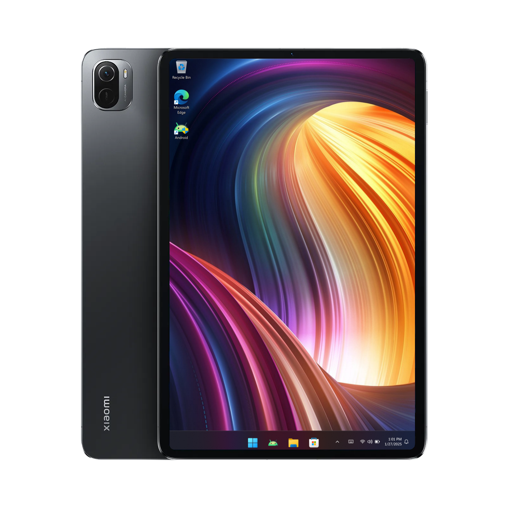

# Xiaomi Pad 5: Switch Secure/Unsecure Boot Without PC


- [](https://t.me/WinInstaller)
#

## Prerequisites
- [`Modded TWRP recovery`](https://github.com/Kumar-Jy/Windows-in-NABU-Without-PC/releases/tag/Modded-TWRP-Recovery)
  
- [`NABU_SB_NSB_boot_switcher_OldDriver.zip`](https://github.com/Kumar-Jy/Windows-in-NABU-Without-PC/releases/download/Files/NABU_SB_NSB_boot_switcher_V4.zip)
- [`NABU_SB_NSB_boot_switcher_V190126.zip`](https://github.com/Kumar-Jy/Windows-in-NABU-Without-PC/releases/download/Files/NABU_SB_NSB_boot_switcher_V260119.zip)

  

## Switching Secure/Unsecure

- Reboot to Android if you are in Windows (do not switch off / force reboot)

- Download NABU_SB_NSB_boot_switcher.zip
  
- Boot to modded TWRP Recovery.
  
- Flash **```NABU_SB_NSB_boot_switcher.zip```** and reboot to system when finished
  
- This will automatically detect the current boot status of your installed Windows and switch it accordingly.
#
## Dualboot
  
- Double click on `Android` icon from windows desktop, to switch back to Android (from Windows).

- To boot into Windows (from Android), Download and Open [Woa-Helper](https://github.com/n00b69/woa-helper/releases/tag/APK) app, allow root permission and press **`QUICK BOOT TO WINDOWS`**
#
